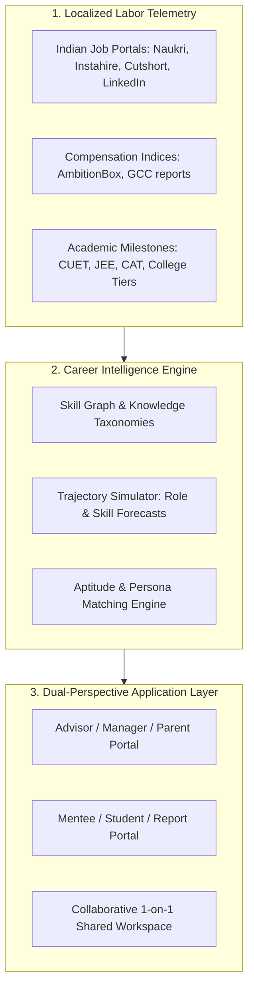

# Executive Summary: Collaborative Career Intelligence Platform
**Document Subtitle:** *Augmenting Managers and Parents as High-Leverage Navigators for the Future of Work*  
**Document Status:** Draft for Co-founder Review & Strategy Alignment  
**Target Market:** India (Primary Beachhead) with Global Scalability  
**Date:** August 2026  

---

## 1. Executive Summary & Core Thesis

### The Core Problem: The Advisor Knowledge Asymmetry
Mentors, managers, and parents are the primary, most trusted sources of career guidance for direct reports and youth. However, they suffer from **experience bias and information latency**:
* **Anchor Bias:** Their advice is naturally limited to their own past career trajectories (what worked 10–20 years ago).
* **Macro Shift Acceleration:** AI adoption, rapid skill obsolescence, and new-age career paths evolve faster than any individual can keep up with.
* **The "Advisor Dilemma":** When a direct report asks *"Where is my role heading in 3 years?"* or a high schooler asks *"What should I study?"*, mentors and parents want to help, but lack the hard labor-market data, skill forecasts, and non-obvious options to guide them effectively.

### The Solution: "Mentor-in-the-Loop" Career Intelligence
Existing solutions try to replace the human advisor with an impersonal chatbot or an algorithmic quiz. **Our thesis is the opposite:**
> **Do not replace the human relationship; augment it.**  
> Build an intelligence platform that acts as a **copilot for advisors and mentees**, equipping managers and parents with real-time labor market telemetry, 3–5 year skill trajectory forecasts, and collaborative roadmaps.

```
       [ Real-time Labor Telemetry + Skill-Graph Forecasting ]
                                  │
                                  ▼
                [ Collaborative Intelligence Platform ]
                     ┌────────────┴────────────┐
                     ▼                         ▼
      [ Advisor / Parent Briefing ]   [ Mentee / Student Sandbox ]
                     └────────────┬────────────┘
                                  ▼
                 [ Shared 1-on-1 Roadmap & Sync ]
```

---

## 2. Two High-Value Use Cases

### Track A: Workplace Enablement (Manager $\rightarrow$ Direct Report)
* **Target Audience:** Engineering managers, team leads, and people managers in tech firms, startups, and Global Capability Centers (GCCs).
* **The Problem:** 
  * Managers spend 1-on-1s on short-term sprint updates rather than strategic career pathing because they lack a framework for career development.
  * Direct reports leave companies for 30–40% salary bumps ("switch culture") because they cannot see a clear, high-growth trajectory within their current organization.
* **The Product Value:** 
  * Generates **"1-on-1 Career Dossiers"** for managers, mapping an engineer's current skills to adjacent high-demand competencies (e.g., service-to-product engineering, distributed systems, applied AI architecture).
  * Equips managers to be retention champions and strategic talent coaches.

### Track B: Family & Youth Career Discovery (Parent $\rightarrow$ High School/College Student)
* **Target Audience:** Urban middle-to-upper-middle-class parents with kids in Grades 9–12 and early college.
* **The Problem:** 
  * High anxiety around future job security. Parents realize the traditional playbook (*"just do engineering or medicine"*) is breaking due to tech automation and IT hiring slowdowns, but have zero visibility into alternatives.
  * Strained household discussions: Parents push what is safe; teenagers push vague interests without data on career viability or compensation.
* **The Product Value:** 
  * Objective, data-backed bridge between student aptitudes and viable, emerging professions (e.g., Product Design, Quantitative Finance, Renewable Energy Engineering, BioTech, Cyber-Law).
  * Provides concrete milestone roadmaps (stream selection, entrance examinations, college tiers, portfolio projects).

---

## 3. Why India? Critical Market Dynamics

1. **Massive Household Spend on Education:** Indian parents exhibit one of the highest willingness-to-pay rates globally for educational outcomes and career security (from coaching institutes to study-abroad consultants).
2. **The "IT Services" Disruption:** Massive legacy IT service firms (TCS, Infosys, Wipro, Accenture) have historically absorbed hundreds of thousands of Indian graduates annually. As AI and client automation reduce entry-level recruitment, parents and graduates are in search of new, future-proof pathways.
3. **The GCC (Global Capability Center) Boom:** India hosts over 1,600+ GCCs employing over 1.6 million high-value professionals. GCCs require product thinking, advanced domain depth, and architecture skills—creating a massive demand for internal upskilling and career navigation tools.
4. **Data Localization Requirement:** Western datasets like O*NET do not account for Indian compensation tiers (Early Startup vs. GCC vs. Service Firm), entrance cutoffs (JEE/NEET/CUET/CAT), or campus placement dynamics (Tier 1 vs. Tier 2/3). A localized platform has a strong defensible moat.

---

## 4. Competitive Landscape & Whitespace Analysis

| Category | Representative Players | Primary Focus | Why They Fall Short |
| :--- | :--- | :--- | :--- |
| **Enterprise Talent Intelligence** | Eightfold.ai, Gloat, Fuel50 | Enterprise HR planning, internal gig marketplaces | Built top-down for HR leaders, not for empowering individual managers in weekly 1-on-1s. |
| **K-12 School Systems** | Xello, Naviance, Scoir | US school district college applications | Administrative compliance and college admissions; lacks dynamic labor market forecasting and parent co-piloting. |
| **Indian EdTech & Aptitude Tests** | Univariety, Mindler, YouScience | One-time psychometric tests and stream counseling | Static PDF reports; no ongoing skill graph, no live market telemetry, and no collaborative roadmap tracking. |
| **Direct-to-Consumer Job Search AI** | Kickresume, CareerGPS, Pluto | Resume optimization & automated applications | Reactive job-hunting tools rather than proactive multi-year career design. |

### Our Unfair Advantage & Differentiator:
* **Dual-View UX (Advisor + Mentee):** We design for *two stakeholders in conversation*, providing the mentor with discussion talking points and the mentee with an exploratory sandbox.
* **Continuous Trajectory Simulation:** Not a static assessment, but a live career simulator (*"If you master skills X + Y over the next 12 months, role Z becomes attainable with a 40% compensation premium"*).

---

## 5. Product Architecture & Key Capabilities



### Core Modules:
1. **Telemetry & Skill Graph Engine:** Ingests live job market signals, salary distributions across company tiers, and emerging skill velocities.
2. **Trajectory Simulator:** Computes skill adjacencies, estimated learning curves, and projected demand over 3–5 year horizons.
3. **The Advisor Briefing Room:** 
   * Pre-meeting briefing cards (e.g., *"3 emerging tracks for your report based on recent projects"*).
   * Conversation starters and coaching questions.
4. **The Mentee Discovery Sandbox:**
   * Interactive "Day in the Life" previews of modern roles.
   * Curated skill-bridging paths (curated certifications, open-source projects, college electives).
5. **Shared Roadmap Canvas:** Mutually agreed goals, milestone tracking, and quarterly sync reminders.

---

## 6. Business & Monetization Models

```
                        ┌─────────────────────────────────────┐
                        │        Monetization Models          │
                        └──────────────────┬──────────────────┘
                                           │
         ┌─────────────────────────────────┼─────────────────────────────────┐
         ▼                                 ▼                                 ▼
   [ B2C Family ]                 [ B2B2C Institutional ]             [ B2B Enterprise ]
• Milestone Packs (₹2,999 - ₹7,999)• School & Coaching Portals      • Per-Seat SaaS (₹300-800/mo)
• Annual Subscriptions            • University Placement Cells      • L&D / Manager Enablement
```

1. **B2C (Family Subscriptions & Milestone Packs):**
   * High-intent, high-conversion milestones: Class 10 Stream Selection, Class 12 College Major Roadmap, Early Career Launchpad.
   * *Pricing:* ₹2,999 – ₹7,999 one-time milestone dossier, or ₹500/month continuous tracking.
2. **B2B2C (Private Schools, Coaching Centers & Universities):**
   * Institutional licensing for premium CBSE/ICSE schools and coaching institutes looking to provide value-added career guidance to parents.
3. **B2B SaaS (Enterprises & GCCs):**
   * Sold to corporate People Ops and Engineering VPs as a **Manager Enablement & Retention Platform**.
   * *Pricing:* ₹300 – ₹800 per employee per month.

---

## 7. Key Strategic Decisions for Co-Founders

Before building the MVP, we need consensus on three critical decisions:

1. **Beachhead Selection (Where to start?):**
   * **Option A: B2B Enterprise / GCC Focus.** Start with Engineering Managers guiding Software Engineers.  
     * *Pros:* Clear skill graphs, high corporate willingness-to-pay, shorter feedback loops.
   * **Option B: B2C Parent & Student Focus.** Start with Class 10–12 / College Students and their parents.  
     * *Pros:* Massive emotional urgency in India, massive addressable market, no long enterprise sales cycles.
2. **MVP Data Strategy:**
   * Do we build on curated vertical datasets (e.g., deep indexing of 50 high-growth modern roles in tech, data, and design), rather than trying to map the entire universe of jobs on Day 1?
3. **Initial Feature Hook:**
   * Should our initial viral wedge be an **"AI 1-on-1 Prep Dossier Generator"** that any manager or parent can generate for free in 2 minutes by entering a brief profile?

---

*This document is ready for review by the founding team. Feedback and alignment on the beachhead will dictate the Phase 1 MVP sprint plan.*
